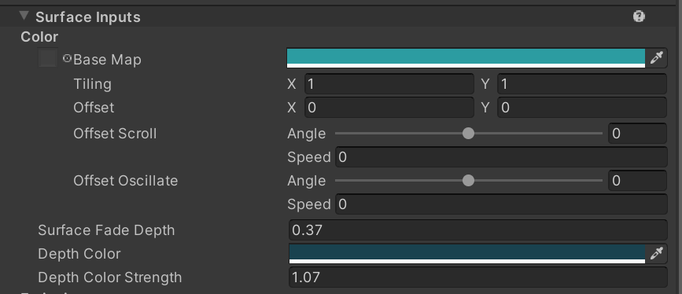
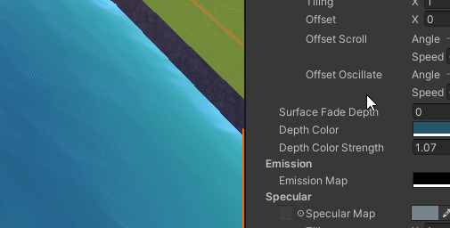
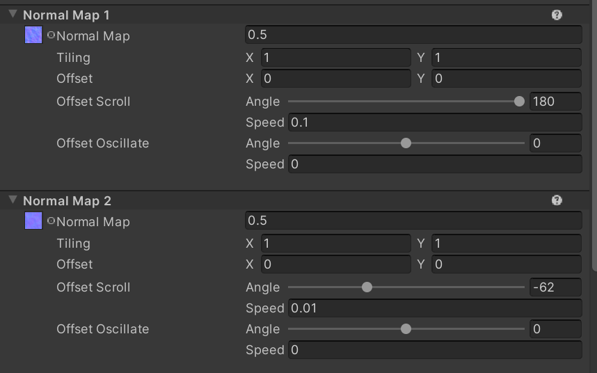
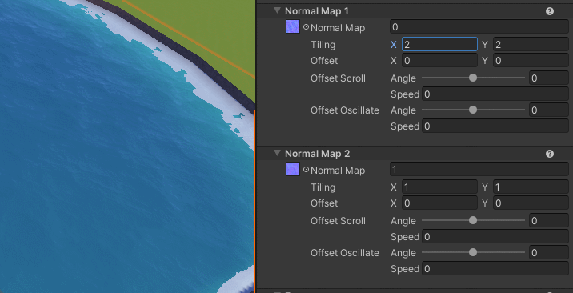
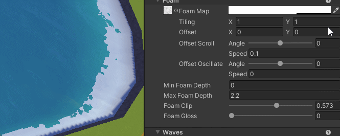
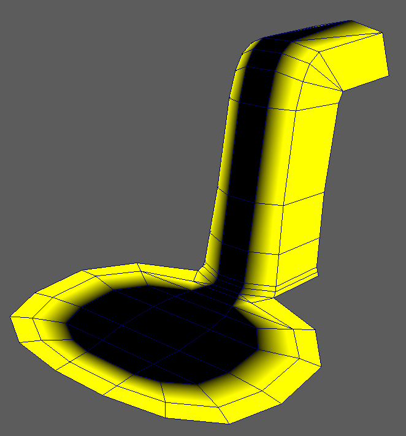
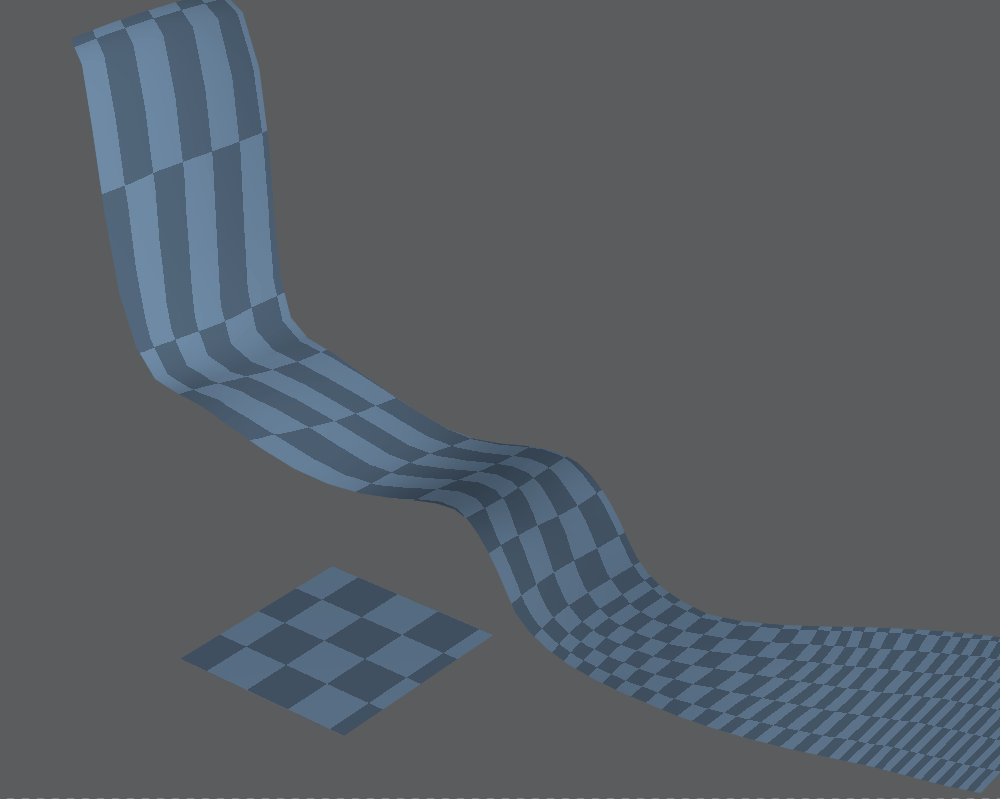

# Water Shader
Rec Room Studio has a water shader that can be used to make a myriad of fun different liquids that have depth, flow, and produce foam effects where they collide with objects. This section will explain how to use the water shader and include some tips and tricks.

## Getting started with the water shader

### How to add the water shader to your #rrstudio room

In your Project window, right-click Create>Material to make a new Material. Select your newly-created material. In the Inspector window’s Shader section, select the Rec Room Studio Water. You can now add the material to your room by dragging it onto a 3D object (like a plane, cube, etc) in your Scene or Hierarchy window.

### Default Water Assets

If your version of Rec Room Studio is older, you can download a package of premade prefabs and materials that use the water shader from here: <https://discord.com/channels/1032079737234915398/1202372332304212009>

Once you have the default water assets created by the Rec Room art team, you can find them in your Project window in the Assets\DefaultAssets\Prefabs\Environmental Assets\Water Examples

In this folder are prefabs and materials that you can add directly to your room by dragging them from the Project window into your Scene or Hierarchy window.

# Water shader settings

###  Base texture

Here is where you can add custom textures to the water shader and control the size, speed, angle, and oscillation (Back and forth movement)

Your surface fade depth is how much the shoreline fades and your depth color strength controls the amount of your depth color

### Emission

This color controls how much something glows, so you can make as many radioactive waterfalls as you'd like! 

There is subtle emission used on the ice waterfall example to emulate depth. The Ice Base Map has an alpha texture which controls what parts of the texture emit. 

### Specular

Here is where you can alter the reflection and shininess of your liquid. A specular map and color controls the tint and strength of the reflection. Smoothness determines if the surface is rough/matte or smooth/polished.

###    Normal Maps

In this shader you get two normal map slots! You can control the strength, tiling, offset, angle, speed, and oscillation of each one to produce different effects. For example, for a river you could increase the speed and adjust the angle so it flows in the direction you want. Having two normal maps scrolling at different angles creates a nice layering effect!

### <a name="Foam"> Foam

Foam is what gathers at the edges of your water and is generated automatically based on these settings on high-memory platforms. Whatever texture you use is put through a threshold filter to make a cutout which gives you your foam shape! You have the same amount of control for this as the base color and normal maps. There are some foam specific settings:

**Min Foam Depth** - How much the foam fades from the shore

**Max Foam Depth** - Amount of foam

**Foam Clip** - Runs your texture through a threshold filter

**Foam Gloss** - How shiny the foam is

### <a name="Waves"> Waves

The water shader has the ability to have waves so you add movement to your water. Waves rely on the geometry of your mesh, so make sure you have enough vertices for a smooth wave. 

**Angle** - Direction of the wave

**Wavelength** - Width of the wave

**Steepness** - Height of the wave

## Tips and Tricks

### Vertex Colors

Vertex colors give you some more control of your water shader. These can be applied in your modeling program or choice or if you're using probuilder, use the vertex colors panel. Here are the colors you can use and what they do:

**Yellow** = Foam + Waves

**Red** = Foam + No Waves

**Green** = No Foam + Waves

**Black** = Nothing

**Important Note:**  Foam painted in using vertex colors appears on all platforms, including mobile. This is the best way to get foam on all platforms.

\*Colors used in the vertex color example asset

\*Colors used in the waterfall example asset

### UVs

You can utilize your UV layout in order to get different results with your water shader. Having your UV edges closer together will result in faster motion whereas spacing them further apart will result in slower motion. This is great to create the effect of water rushing through a waterfall and slow down at the base.

This also works for other materials, such as Lava. Moving verts in your UV sheet will result in warping. In the UV sheet down below, you can see how the model’s UVs were edited in order to create the warping effect.

