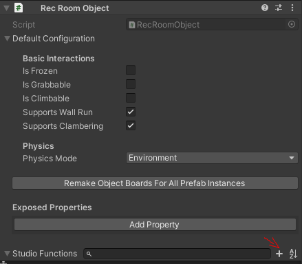
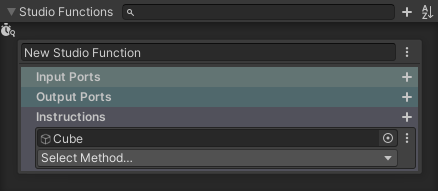
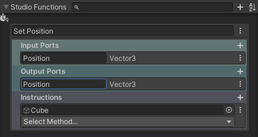
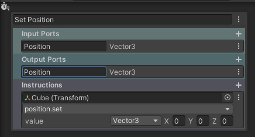
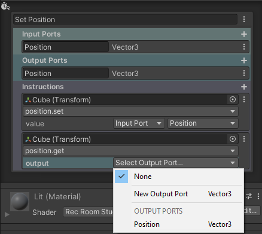
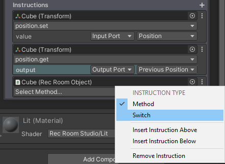
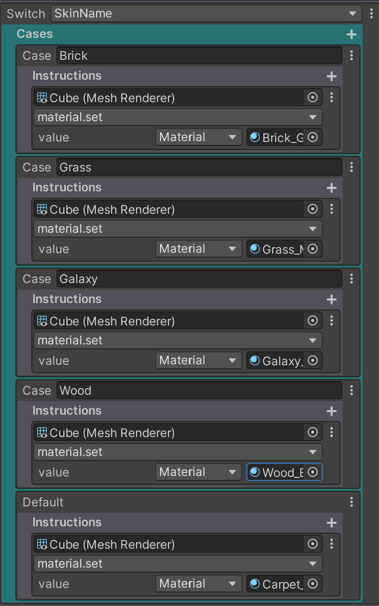
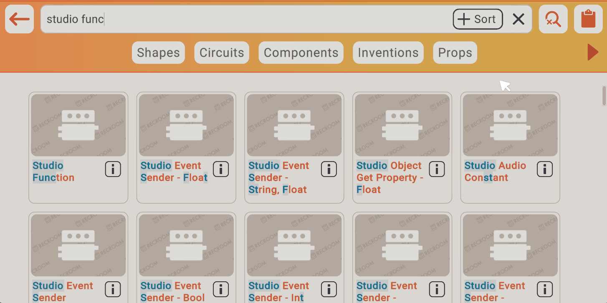
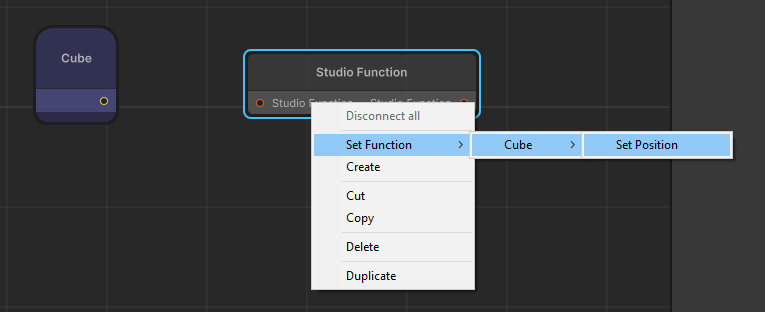

# Studio Functions

:::danger

"Studio Functions have been discovered to have been released in a state that can cause room Circuit corruption (which can be really bad). **The Studio Functions feature has been turned off for now. [Studio Events](/docs/cv2instudio/Events/senders) will return.**

If you've already added Studio Functions to your room, you will still be able to edit those functions. New Studio Functions cannot be added, however. If you already have Studio Functions added to your Studio Props, please proceed with caution when editing: avoid renaming or deleting Studio Functions and double-check that all Studio Function chips in the subroom are set for accurate function calls before using "Play" or "Upload"."

(Copied from the Studio Discord server)
:::

 Use Studio Functions to build complex, reactive logic to empower Studio Props with custom Circuits chips.

## Summary

Studio Functions are a Rec Room Studio feature that enables you to author custom chips that call GameObject and Component methods on your Rec Room Objects.  Studio Functions support a wider variety of data types and can call C# methods with any number of parameters.  Studio Functions can also forward the return values from C# methods to other chips in your room’s Circuit graph.  Want to locally set the Position and Rotation of your object? You now can! Most GameObject and Component methods and properties are supported, so if there’s one you’d like to know more about, you can look it up [here](https://docs.unity3d.com/ScriptReference/GameObject.html)

## Setting up a Studio Function

Select a Studio Prop in your scene (for more information on Studio Props see [Creating Custom Rec Room Studio Objects](/docs/BuildinginRRS/custom)). In the Unity Inspector tab you will see a new section titled Studio Functions. Prefabs created before the introduction of Studio Functions will see both UnityEvents and Studio Functions, but new prefabs will only see Studio Functions. Click the \[+\] button next to the functions search bar to add your first Studio Function.

You’ll notice that a new UI comes up, with 3 main categories that describe your new Studio Function. Instructions, Input Ports and Output Ports as seen on the UI you just uncovered. Let’s cover each one, starting with Input Ports.

### Input Ports

Input Ports are the input pins on your Studio Function chip, you can add an Input Port by clicking the + next to it, give it a name, then select the type of port you’d like to expose as an input. You can set the input ports to these Circuits constant types: Int, Float, Bool, String, Vector2, Vector3, Color, Color32 and Quaternion. You can add more than one input port; it’s especially useful if your function has more than one instruction.

In this example, I’ll be creating a function to set the position of my cube. To do this, I need to have a Vector3 input port so that I can use Vector chips in-game to control the position of my cube. If you want to change type, you’ll need to remove the port and add a new one. To remove one, click the 3 dots next to it and click “Remove Input Port”.

### Output Ports

Output Ports are the output pins on your Studio Function chip. Similar to Input Ports, you can add an Output Port by clicking the + next to it, give it a name and select the type you’d like to expose as an output. For this function, I’m going to add an Output Port of the position of my cube.

### Instructions

Instructions are similar to UnityEvents, where you can tell your object to do a specific thing when the function is called. Although now, you’re not limited to the Studio Event types we provided you with before, but you can still call UnityEvents with instructions. There are 2 different types of instructions you can call, let’s go over them.

#### Methods

Methods are the ones that are a lot like UnityEvents and are selected by default when creating instructions, you select the object in the prefab you want to set up with a method and can choose from a variety of methods and functions. In this example, I select the Cube game object of my Studio Prop by dragging it onto the line under “Instructions, then choose the method position.set from the dropdown below the game object line.

From the looks of it, the value is a default Vector3 with 0,0,0 being the coordinates. Let’s change that to point at our input port we set up earlier. To do that, select the type under Value and choose the name of your input port you set up earlier.

Then, I’ll add an instruction to send the vector3 of the Cube’s position to the Output port. First, I click the + button to the right of Instructions to add a new Instruction. Once again, I drag the game object Cube onto the game object input line and this time  select “position” and “get” (position.get). Last, I’ll select the Output port as the destination for the position.set value.

And now, our method is set up. Once we fire the execution on our function in-game, it will both set the position to the input vector and get its position as an output.

#### Switches

You can change an instruction from a method to a switch. A switch acts the same as it does in Circuits, where it will compare between Input Port values that are either a bool, a string or an int. To turn your instruction into a switch, select the 3 dots next to the object selected in your instruction and choose Switch under Instruction Type.

Select an input port next to “Switch”. You can then add new cases by hitting the + next to “Cases” The value on each case is the one you want to compare to the input port. In this example, I’m using a string and comparing it with “Example” and “Test”. One enables my GameObject, while the other disables it.

I can then set up a switch to change the material on my object using the material.set property based on a string, which would be my material name.

### Studio Function Chip

Once your object is in-game, look for the Studio Function chip in the palette

Spawn it and use the configure tool on it. Select the Function dropdown and choose the function that you want, that belongs to your object. It should be “FunctionName ObjectName”. Once selected, you should see the chip match the input/output ports you set up earlier. Connect the port with your object’s name to the Object Board of your Studio Prop and it’s ready to have its function executed using the execution input!

You can also set a function on the chip using the Circuit Editor within RRStudio. Right-click the chip and look for the Set Function dropdown. (Set Function > ObjectName > FunctionName)

